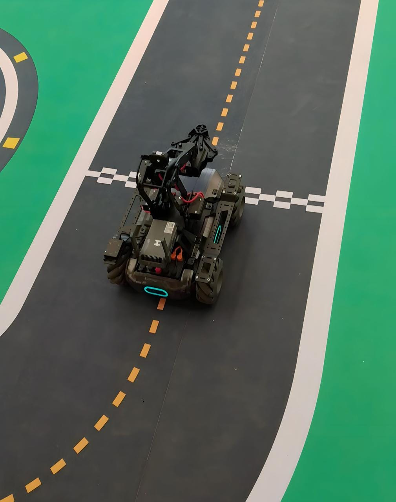
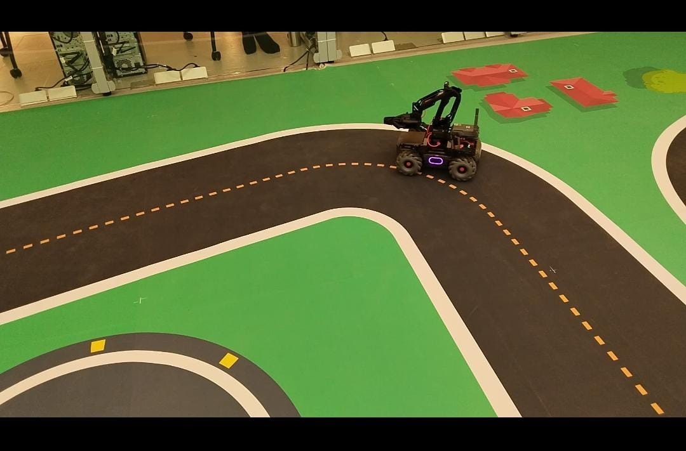
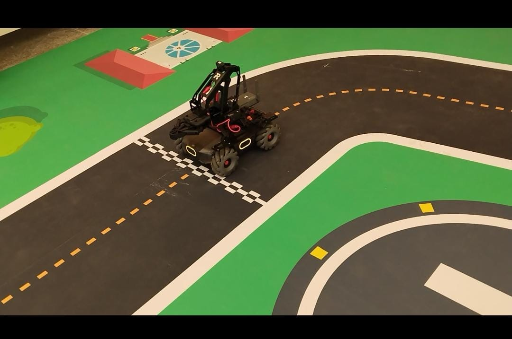

# MobileRobot-Openloopcontrol
## Aim:

To develop a python control code to move the mobilerobot along the predefined path.

## Equipments Required:
1. RoboMaster EP core
2. Python 3.7

## Procedure

Step1:

Use from robomaster import robot

Step2:

Choose the x,y,z - axis movement distance(meters). Step3: Give ep_chassis.move to move straight.


Step3:

Give ep_chassis.move to move straight.


Step4:


Give time.sleep() for a break.

Step5:

Give ep_chassis.drive_speed to have a circular movement

## Program
```python
```
from robomaster import robot
import time

if __name__ == '__main__':
    ep_robot = robot.Robot()
    ep_robot.initialize(conn_type="ap")

    ep_chassis = ep_robot.chassis

    from robomaster import robot
import time
from robomaster import camera


if _name_ == '_main_':
    ep_robot = robot.Robot()
    ep_robot.initialize(conn_type="ap")

    ep_chassis = ep_robot.chassis
    ep_led = ep_robot.led
    ep_camera = ep_robot.camera

    print("Video streaming started.....")
    ep_camera.start_video_stream(display=True, resolution = camera.STREAM_360P)

   
    
    ep_chassis.move(x=2.8, y=0, z=0, xy_speed=1).wait_for_completed()
    ep_led.set_led(comp = "all",r=255,g=100,b=0,effect="on")


    ep_chassis.move(x=0 , y=0, z=50, xy_speed=1).wait_for_completed()
    ep_led.set_led(comp = "all",r=204,g=255,b=204,effect="on")


    ep_chassis.move(x=0.4, y=0, z=0, xy_speed=1).wait_for_completed()
    ep_led.set_led(comp = "all",r=255,g=0,b=255,effect="on")


    ep_chassis.move(x=0, y=0, z=45, xy_speed=1).wait_for_completed()
    ep_led.set_led(comp = "all",r=153,g=204,b=0,effect="on")


    ep_chassis.move(x=0.8, y=0, z=0, xy_speed=1).wait_for_completed()
    ep_led.set_led(comp = "all",r=204,g=204,b=255,effect="on")


    ep_chassis.move(x=0, y=0, z=85, xy_speed=1).wait_for_completed()
    ep_led.set_led(comp = "all",r=128,g=0,b=0,effect="on")


    ep_chassis.move(x=1.2, y=0, z=0, xy_speed=1).wait_for_completed()
    ep_led.set_led(comp = "all",r=255,g=0,b=0,effect="on")

   
    ep_chassis.move(x=0, y=0, z=-45, xy_speed=1).wait_for_completed()

    ep_chassis.move(x=1.7, y=0, z=0, xy_speed=1).wait_for_completed()
    ep_led.set_led(comp = "all",r=102,g=0,b=202,effect="on")


    ep_chassis.move(x=0, y=0, z=43, xy_speed=1).wait_for_completed()


    ep_chassis.move(x=1.4, y=0, z=0, xy_speed=1).wait_for_completed()

    ep_chassis.move(x=0, y=0, z=95, xy_speed=1).wait_for_completed()
    ep_led.set_led(comp = "all",r=0,g=0,b=128,effect="on")


    ep_chassis.move(x=2.2, y=0, z=0, xy_speed=1).wait_for_completed()

    ep_chassis.move(x=0, y=0, z=80, xy_speed=1).wait_for_completed()

    ep_led.set_led(comp = "all",r=255,g=102,b=0,effect="on")

    ep_chassis.move(x=0.6, y=0, z=0, xy_speed=1).wait_for_completed()

    time.sleep(4)
    
    
    p_camera.stop_video_stream()
    print("Stopped video streaming.....")
    ep_robot.close()


    
    ep_robot.close()
```
```

## MobileRobot Movement Image:


Insert image here


<br/>
<br/>
<br/>


## MobileRobot Movement Video:

Upload your video in Youtube and paste your video-id here

https://youtu.be/Mhj7OcQrFbo

<br/>
<br/>
<br/>
<br/>

## Result:
Thus the python program code is developed to move the mobilerobot in the predefined path.


<br/>
<br/>

```
Mobile Robotics Laboratory
Department of Artificial Intelligence and Data Science/ Machine Learning
Saveetha Engineering College
```
